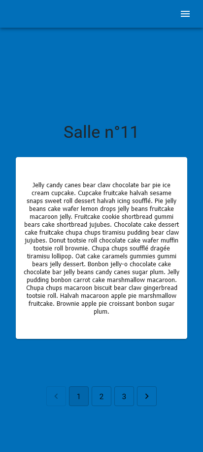

# Escape Game

Il est constitué de 3 parties à savoir :
- une application web : reservations des séances
- une application mobile : lancement des parties
- une application desktop : surveillances des parties

Ce projet est un outil de lancement des parties d'escape game.

https://cedricauc.github.io/escapegame

Le projet mobile Escape Game est une application React Native. \
Le projet affiche les séances dans une liste. Le “maître du jeu” est en charge du démarrage d'une séance. L'application chronomètre le temps de jeu et affiche pour chaque salle un indice pour résoudre les énigmes.
Dans le cas où le temps de jeu dépasserait la durée prévue d'un scénario, le “maître du jeu” est averti par une notification push.

## Pré-requis

Pour l'application mobile :
- [Node.js](https://nodejs.org/en/download/) : back-end
- [ReactNative](https://reactnative.dev/docs/environment-setup) : front

## Installation

- A la racine du projet, lancez les commandes
```sh
npm install
```

## Utilisation

Commandes pour lancer le serveur Node.js
```sh
npm start
```

Lancement de l'application en local.\
Ouvrir [http://localhost:3000](http://localhost:3000) pour afficher dans le navigateur.

**Identification interface:**\
utilisateur: admin\
mot de passe: admin

## Visuel de l'application

**Liste des séances**\


**Partie en cours**\
